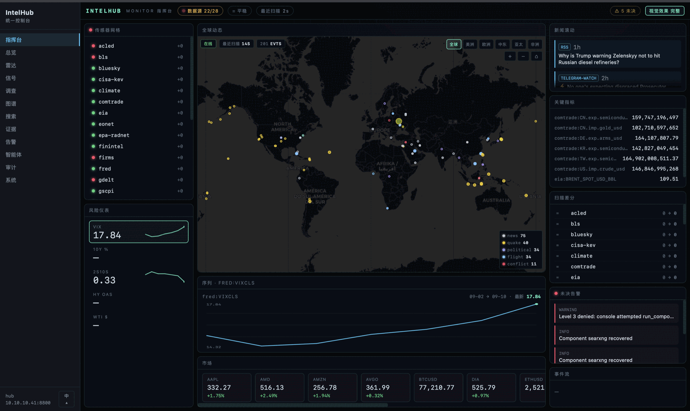

# IntelHub — OSINT 情报中枢

不绑定特定 agent、原生支持 MCP、Docker 优先的单机 OSINT 基础设施。Rust 编写的
hub-core 通过统一的 Model Context Protocol 网关暴露整个信号层：证据存储、
事件总线、策略与成本治理、内置信号采集器、带全球雷达地图的 Web 控制台，
以及 Prometheus/Grafana 可观测性栈。

> 英文版：[`README.md`](README.md)



---

## IntelHub 是什么？

IntelHub 让一台全新的 Linux 虚拟机通过一行 curl 命令变成一个自给自足的
OSINT 工作台。它从公开来源（网页爬取、社交媒体、OSINT 监控器、市场/气候/制裁数据）
采集信号，去重并排序后，把每条结论带完整证据链落地存储，再通过 MCP 工具暴露给任何
agent（pi、codex、自定义）调用。Web 控制台给人类提供同样的视图：全球雷达地图、
调查工作台、知识图谱画布、实时活动流。

所有组件都跑在一台主机上。无 SaaS 依赖。整个栈都已容器化，只有 `hub-core` 例外——
它是原生 systemd 单元（唯一一个非容器服务）。

## 核心特性

- **一键安装** — 在全新的 Linux VM 上 `curl … | bash`，约 10 分钟即可获得
  一个完整可用的 OSINT 栈。崩溃安全：再次执行同一命令自动从断点续装。
- **MCP 原生网关** — 每个能力都作为 MCP 工具暴露。任何 MCP 兼容 agent 都可直接调用
  `hybrid_search`、`investigate`、`crawl_url`、`create_claim` 等，无需定制集成。每次
  MCP 调用都会生成一个 UUID `trace_id`，串联 `cost_records.trace_id`、
  `embedding_jobs.trace_id` 以及响应顶层的 `trace_id` 字段。通过
  `GET /api/v1/traces/{trace_id}` 可以拉出完整的调用关系图（工具审计行、embedding
  任务、rerank token 成本）。
- **内置信号采集器** — 气候（EONET、NOAA）、辐射（EPA RadNet）、地震（USGS）、
  金融（FRED、Treasury、Finnhub、Comtrade、EIA）、制裁（OFAC、USASpending）、
  安全威胁（ACLED、GDELT、Bluesky、Telegram、X/Twitter、RSS）、网页
  （SearXNG、Crawl4AI）。25+ 采集器全部内置到 hub-core 中。
- **证据 + 审计追溯** — 每条 claim、finding、document、source 都可以追溯。claims 有
  audit 行、documents 有反向引用、findings 有证据链。审计日志是 append-only 的。
- **成本与速率治理** — 每个 agent 独立的速率限制（Redis token bucket）、每个 agent
  独立的预算（token / 工具调用 / embed）、策略分级（L3 操作如组件备份需要 admin token）。
- **内置 Web 控制台** — React 19 + Vite，中英双语。包括带黑色底图的全球雷达地图
  （Stadia 主选 → Esri 兜底 → CARTO 末位）、调查工作台、知识图谱画布（带过滤器和侧边
  面板）、实时活动流、审计/搜索/概览页面。
- **可观测性** — Prometheus + Grafana + cAdvisor + node-exporter，抓取 hub-core 的
  `/metrics` 和 docker 栈。预置的 Grafana dashboard 覆盖监控器扫描历史、预算消耗、
  图谱镜像协调、成本记录。
- **知识图谱（Neo4j）** — 实体 / claims / findings 镜像到 Neo4j 用于图查询（路径查找、
  邻居、子图提取）。Reconcile worker 保持 PG 和 Neo4j 同步。
- **混合搜索** — 关键词（通过 Qdrant 的 BM25）+ 语义（通过 T8star / OpenAI 兼容端点的
  embeddings），通过 Reciprocal Rank Fusion 融合，可选的 cross-encoder rerank
  （BAAI/bge-reranker-v2-m3，由 `HUB_RERANK_ENABLED` 控制开关）。通过
  `investigate(question)` 工具实现多跳问答，带规则化 + LLM 兜底规划器。重复查询走
  Redis 结果缓存，键为 `(mode, query, limit, url_contains)`，TTL 300 秒 —— 命中时
  加速 590 倍（7.1 秒 → 12 毫秒）。每个搜索响应都带顶层字段
  `cache: "hit" | "miss" | "disabled" | "error"`；开关为 `HUB_QUERY_CACHE_ENABLED`
  （默认 `true`）。
- **崩溃安全的安装与更新** — 每个步骤都幂等且记录在 `~/IntelHub/.install-state`。
  重跑 install 命令会快速跳过已完成步骤，从失败点恢复。Secrets 是 write-once 的：
  任何重跑都不会覆盖已生成的 key。

## 架构（一句话心智模型）

```
互联网 ──► 内置采集器 ──► hub-core（Rust，systemd） ──► MCP 工具
                                    │                       │
                                    ▼                       ▼
                       Postgres + Redis + Neo4j          pi / codex
                       + Qdrant（向量）                   Web 控制台
                                    │
                                    ▼
                       Prometheus ─► Grafana 仪表盘
```

| 层 | 组件 | 职责 |
|---|---|---|
| 网关 | `hub-core`（Rust，原生） | MCP 服务、REST API、鉴权、速率限制、策略、审计、成本跟踪、内置信号采集器 |
| 存储 | Postgres + Redis + Neo4j + Qdrant | 证据存储、速率限制桶、知识图谱、向量搜索 |
| 传感器 | SearXNG、Crawl4AI、SpiderFoot、Huginn | 网页搜索 / 爬取 / OSINT 桥 |
| 可观测性 | Grafana + Prometheus + cAdvisor + node-exporter | 指标、仪表盘、主机/容器统计 |
| UI | `console/`（React 19 + Vite） | Web 控制台，作为静态文件由 hub-core 提供 |

每个组件的详细职责、schema、SP 里程碑、部署拓扑见
`OSINTIntelligenceHub.md`。

---

## 一键安装（Debian 或 RHEL 系，例如全新的 Proxmox VM）

```bash
curl -fsSL https://raw.githubusercontent.com/rootazero/IntelHub/main/scripts/install.sh | bash
```

安装器走 12 个幂等步骤：

1. **preflight** — 检查 OS / docker / 磁盘 / 内存
2. **fetch-code** — `git clone`（或通过 `INTELHUB_TARBALL=…` 走 tarball）
3. **bootstrap** — nftables LAN 规则、ntp、sysctl
4. **versions** — 解析每个组件的固定版本
5. **secrets** — 写 `core/secrets.env`、`core/hub.env`、`compose/.env`
6. **keys** — **通过 `/dev/tty` 交互提示 API key**（每个都说明对应功能 + "回车跳过"
   后的降级能力）
7. **build-hub** — 在固定的 `rust:trixie` 容器里编译 Rust 二进制
8. **stack-up** — `docker compose up -d` 拉起 data + sensor + ui 三层
9. **build-console** — 在 `node:22-trixie` 里跑 `npm run build`，嵌入地图 key
10. **start-hub** — 启用并启动 `hub-core.service`
11. **provision-agents** — 铸造 agent + console 两个 API key，写入 `core/agent-keys.txt`
12. **verify** — 健康检查（失败时把该步骤标记 undone，重跑时从这里恢复）

每个步骤都记录在 `~/IntelHub/.install-state` 中。**重跑同一命令自动续装**：
已完成的步骤快速跳过、secrets 保持 write-once、最终健康检查重新验证一切。

### 无人值守安装（CI / Terraform / 预配置环境）

复制 [`examples/intelhub.env.example`](examples/intelhub.env.example)，取消注释
并填入你持有的 key，然后：

```bash
curl -fsSL https://raw.githubusercontent.com/rootazero/IntelHub/main/scripts/install.sh \
  | INTELHUB_ENV_FILE=$PWD/intelhub.env bash
```

env 文件中缺失的 key 仍然会通过 `/dev/tty` 提示。配合设置 `INTELHUB_NONINTERACTIVE=1`
可以静默跳过所有提示（对应功能降级，不会中止安装）。

## 一键更新（原地升级 hub-core + docker 栈）

```bash
curl -fsSL https://raw.githubusercontent.com/rootazero/IntelHub/main/scripts/install.sh \
  | bash -s -- update
```

两条轨道顺序执行：

- **Track A — hub-core 代码：** `git pull` → 重新编译 Rust 二进制 → 重启
  `hub-core.service` → 轮询 `/api/v1/health` 直到 200。
- **Track B — docker 栈（智能 diff）：** 跑 `resolve-versions.sh --dry-run`，对比
  `compose/.env` 中的版本固定。无变化走便宜路径（`compose pull && up -d`）；
  有版本变动则先跑一次 `backup.sh`，然后对每个变动组件跑 `upgrade.sh`：
  备份 → 一次性测试 → 提升 → 健康探针 → 失败回滚。

新引入的可选 secret（在不同更新之间加入 `install.sh` 的）会自动合并到现有的
`core/secrets.env` 中作为空条目 —— 下次更新时通过 `INTELHUB_ENV_FILE` 填入。
SpiderFoot commit / Huginn digest 的变更会以手动重建命令的方式提示。

覆盖旋钮：`SKIP_BACKUP=1`（跳过升级前备份，不推荐）、`INTELHUB_ENV_FILE`
（与安装同语义）、`INTELHUB_HOME`、`INTELHUB_NONINTERACTIVE`。

---

## API key 管理

首次安装时 IntelHub 自动铸造两个 API key：

- **agent key** — 供 MCP 客户端（pi、codex、自定义 agent）调用工具使用。会在安装
  横幅中显示。
- **console key** — 供 Web 控制台 UI 与 hub-core 通信。会在安装横幅中显示。

两个 key 都写入 `core/agent-keys.txt`（权限 `0600`），格式 `ihk_<64 个十六进制字符>`。
它们在安装横幅中**只显示一次** —— 请立即复制，横幅不会重新显示。

### 忘记 key 了？重置它。

```bash
bash scripts/reset-key.sh agent      # 重置 agent key
bash scripts/reset-key.sh console    # 重置 console key
bash scripts/reset-key.sh all        # 同时重置两个
```

这个命令做的事：

- 在 PG `api_keys` 表中软删除（soft-revoke）旧 key（保留以供审计，可通过 DB 查询）。
  旧 key **立即**失效 —— hub-core 在每次请求时都会对 key 做哈希查找，无需重启服务。
- 用同一个 `agent_id` 铸造一个新 key（保持 MCP 客户端身份连续）。
- 原子更新 `core/agent-keys.txt`（先写临时文件再用 `os.replace` 替换）。
- 打印新 key + 标记为 "revoked" 的旧 key。

脚本默认拒绝无确认执行（或用 `INTELHUB_NONINTERACTIVE=1`）。也可以通过安装器调用：
`bash scripts/install.sh reset-key agent`。

### 更新不会动 key

`step_provision_agents` 是幂等的：如果 `core/agent-keys.txt` 里已经存在同名 key，
该步骤直接跳过。重跑 `install.sh` 或 `bash scripts/install.sh update` **绝不会**
自动轮换 key。

---

## 安装与更新覆盖（速查表）

| 覆盖变量 | 作用 |
|---|---|
| `REDO=keys` | 重新走交互式 key 提示（安装） |
| `REDO=versions` | 重新生成 `compose/.env` 中的版本固定 |
| `FORCE=1` | 清空 `.install-state`；重跑每个步骤（secrets 仍 write-once） |
| `INTELHUB_NONINTERACTIVE=1` | 静默跳过所有 key 提示 |
| `INTELHUB_HOME=<dir>` | 安装根目录（默认 `~/IntelHub`） |
| `INTELHUB_LAN=<cidr>` | nftables 用的 LAN CIDR（默认 `10.10.10.0/24`） |
| `INTELHUB_TARBALL=<url>` | 用 tarball 拉源码而非 `git clone` |
| `INTELHUB_ENV_FILE=<file>` | 提示之前预加载 key（安装或更新） |
| `SKIP_BACKUP=1` | 仅更新 —— 跳过升级前备份（不推荐） |
| `bash scripts/reset-key.sh <agent\|console\|all>` | 轮换 API key |

---

## 系统要求

- **操作系统**：x86_64 上的任意 Linux —— 两大主流发行版族都支持：
  - **Debian 系**：Debian 12+（bookworm/trixie）、Ubuntu 22.04+、Linux Mint、Pop!_OS、
    Elementary、Kali、Raspbian，以及任何 `ID_LIKE` 包含 `debian` 的发行版。
  - **RHEL 系**：RHEL 8+/9、CentOS Stream 8+/9、Rocky Linux 8+/9、AlmaLinux 8+/9、
    Fedora 36+、Amazon Linux 2023+、Oracle Linux，以及任何 `ID_LIKE` 包含 `rhel`
    或 `fedora` 的发行版。

  安装脚本通过 `/etc/os-release` 自动检测并适配包管理器（`apt-get` 还是
  `dnf`/`yum`）、Docker 仓库路径、自动更新机制（`unattended-upgrades` 还是
  `dnf-automatic`）。两个家族最终产出完全一样的端点状态 —— 一个能在固定 LAN IP 上
  工作的 `hub-core` + Docker 栈。用 `INTELHUB_FORCE_OS=1` 可绕过检测（用于其他未官方
  支持的发行版 / 未来家族）。
- **硬件**：最少 4 vCPU / 8 GB 内存（Proxmox VM 是参考配置）。如果跑重型 embedding /
  crawl 任务，建议 16 GB。
- **磁盘**：系统 + docker 栈 + 原始数据 + manifests 共需约 20 GB。爬取的 HTML 和快照增长
  很快 —— 如果打算大量爬取，建议挂独立的数据卷。
- **网络**：出站 HTTPS 到 GitHub、Docker Hub、SearXNG 上游引擎、T8star / OpenAI 兼容的
  embedding 端点、可选的第三方数据 API（FRED、EIA、BLS 等）。
- **LAN**：在 LAN CIDR 内一个固定的 IPv4 地址（安装脚本会设置 nftables 规则只允许该
  CIDR 访问 hub-core 的 8800 和 Grafana 的 3001）。用 `INTELHUB_LAN` 覆盖。

## 目录结构

- `hub-core/` — Rust hub（原生 systemd 服务，§20 指令的例外）
- `compose/` — 固定版本的多文件 compose 栈（base/data/sensor/ui）
- `console/` — React 19 + Vite 控制台（中英双语），由 hub-core 提供
- `scripts/` — install.sh、update.sh、reset-key.sh，以及 build/deploy/health/acceptance 工具
- `manifests/` — 组件注册表（版本、升级策略）
- `OSINTIntelligenceHub.md` — 完整项目规范（1700+ 行：每个组件、schema、SP 里程碑、部署拓扑）
- `examples/` — `intelhub.env.example` 用于无人值守安装
- `docs/superpowers/specs/` — 各子项目设计文档

## 运维

随仓库一起发布的运维工具，都放在 `scripts/` 里。可以在任意主机上用 agent key 跑——
开发机 Mac（走 ssh）或者虚拟机本身（本地）。

### 跑验收套件

```bash
KEY=$(ssh -o BatchMode=yes IntelHub 'grep "api_key:" ~/IntelHub/core/agent-keys.txt | head -1 | grep -o "ihk_[a-f0-9]*"')
for a in sp3 sp6 sp7 sp8 sp9 sp10; do
  echo "== $a =="; python3 scripts/accept-$a.py "$KEY" 2>&1 | tail -1
done
```

每个脚本输出 `== N passed, K shelved, M failed ==`。`shelved`（sp5/6/7）覆盖
缺失 API key 的场景 —— 退出码仅反映 `failed`，所以 shelved 检查不会破坏 CI。
用 `INTELHUB_SSH=<alias>` 覆盖 SSH 目标。套件自动检测 `$INTELHUB_HOME/core/hub`
回落到本地执行，所以同一套脚本在部署机和你笔记本上都能跑。

### 写自己的脚本 —— 用 `scripts/_remote.py`

不要手搭 `subprocess.run(["ssh", ...])`。直接导入这个 helper：

```python
from _remote import (
    sh, pg, pg_stdin, pg_params,   # shell + Postgres
    redis, cypher,                 # Redis + Neo4j
    grafana_creds, grafana_request, # Grafana
)
```

它通过 `$INTELHUB_HOME/core/hub` sentinel 自动决定走 ssh 还是本地 —— 无需
`INTELHUB_LOCAL` 开关。Redis / Neo4j / Grafana 的鉴权自动从 `compose/.env` 抽取。
`pg_params` 只用于受控输入的测试夹具；不可信输入请走 `pg_stdin`。

### Schema 变更后回填 Neo4j 图谱镜像

幂等 —— 任何迁移动到 entities / findings / claims / documents 后都可以放心重跑：

```bash
python3 scripts/backfill-neo4j-graph-mirror.py    # entities / relationships / documents / findings / claim_evidence / finding_evidence
python3 scripts/backfill-neo4j-entity-ids.py      # 孤儿 entity_id=NULL 修复
python3 scripts/backfill-finding-entities.py
python3 scripts/backfill-claim-audit.py
```

### 设置或轮换黑色底图的 key

```bash
bash scripts/set-dark-map-key.sh
```

按 key 形状自动检测 Stadia（UUID 形态）还是 CARTO（`cb1_` 前缀），同时写入
`compose/.env` 和 `console-build.env`。两者都有时优先 Stadia。控制台上的红色
"DARK MAP KEY MISSING" 徽章表示两者都没设。改完后跑一次
`bash scripts/build-console.sh` 重建控制台才会在 UI 里生效。

### 不跑完整 installer 也能更新 `compose/.env`

如果手改后在 `compose/.env` 里留下了未展开的 `$(...)` 模板（docker-compose 不会展开
`$(...)` —— 一个常见陷阱），`update.sh` 会通过 `verify_templates()` 自动检测并重新
生成。底层脚本是 `resolve-versions.sh`（读 `FORCE=1 bash scripts/resolve-versions.sh`
以当前固定版本全量重新生成）。